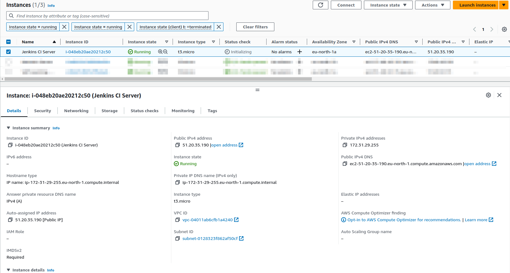
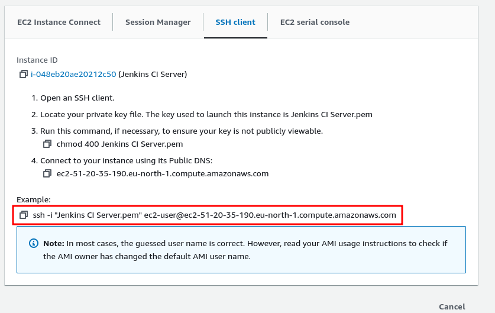

# AWS Configuration for Jenkins

## We will be setting up a Jenkins, in the end we shoud have:
1. An AWS EC2 instance running Ubuntu 22.04 LTS
2. Jenkins setup running on Docker

### To setup the environment, you need to have an AWS EC2 instance configured as follows:
1. Log in to your AWS account
1. After you are logged in, select the __Services__ button:
1. Select __Compute__
1. Select __EC2__ for a Virtual Private Server in the cloud<br/>

1. Launch a new instance by selecting __Launch Instances__:

1. Fill in the __Name__ of your server, and select the __Ubuntu OS__ image

1. Leave the __Instance Type__ section as is
1. In the __Key Pair__ section, select __Create key pair__ fill in the details, and you will be prompted to download the key .pem file, and keep it in a Folder where it's easily accessible from your terminal.

1. In the __Network Settings__ section, select *Allow HTTPS traffic from the internet* and *Allow HTTP traffic from the internet*

1. Configure the storage requirements as you like, but we will be using the default __8 GiB gp2__ configuration
1. Select __Launch Instance__ in the __Summary__ section:

1. You can now see your __EC2__ instance, in the __Instances__ list:

1. Select __Connect__, and choose __SSH Client__ to get the details of the remote SSH connection.

1. This is where the downloaded Identity file from the __Key Pair__ created is needed. Open up a terminal of your choice, and type
```bash
ssh -i "/path/to/Jenkins CI Server.pem" ubuntu@ec2-13-49-75-177.eu-north-1.compute.amazonaws.com
``` 
you will be connected to your EC2 instance.

### Docker Installation
After establishing an SSH connection to your EC2 instance, here is where Docker will be installed. 
For installation of docker in Ubuntu [Go here](https://docs.docker.com/engine/install/ubuntu/). In my case this were the steps followed:
1. Set up Docker's apt ppa repository:
  ```bash
  # Add Docker's official GPG key:
  sudo apt-get update
  sudo apt-get install ca-certificates curl gnupg
  sudo install -m 0755 -d /etc/apt/keyrings
  curl -fsSL https://download.docker.com/linux/ubuntu/gpg | sudo gpg --dearmor -o /etc/apt/keyrings/docker.gpg
  sudo chmod a+r /etc/apt/keyrings/docker.gpg

  # Add the repository to Apt sources:
  echo \
    "deb [arch="$(dpkg --print-architecture)" signed-by=/etc/apt/keyrings/docker.gpg] https://download.docker.com/linux/ubuntu \
    "$(. /etc/os-release && echo "$VERSION_CODENAME")" stable" | \
    sudo tee /etc/apt/sources.list.d/docker.list > /dev/null
  sudo apt-get update
 ```
2. Install the Docker package:
```bash
sudo apt-get install docker-ce docker-ce-cli containerd.io docker-buildx-plugin docker-compose-plugin
```
3. Add the `ubuntu` user to the `docker` group
```bash
sudo usermod -aG docker
```
4. Logout and then login to your server again, the permissions of your user shall now be up-to-date. You can test by running:
```bash
docker ps
```
if no permissions error shows up, you have setup docker succesfully.

### Jenkins Installation

After setting up Docker, I installed Jenkins using the Docker runtime as follows:
1. Create the Jenkins docker network:
```bash
docker network create jenkins
```
2. Create the Jenkins home folder: `sudo mkdir -p /opt/jenkins/home`
2. Make the `ubuntu` user the owner of the jenkins folder: `sudo chown -R ubuntu /opt/jenkins/`
2. Create a file name `/opt/jenkins/docker-compose.yml` with the contents of `docker-compose-ci-server.yaml`
2. Run `docker compose up -d`
2. You can check the status of your application by running:
```bash
docker ps
```
7. That's it setting up your CI/CD server, you can now access it using the public IP `http://13.49.75.177/`. __NOTE__: SSL has not been enabled.

8. You can find the administrator password at `/var/jenkins_home/secrets/initialAdminPassword
` since we are using docker the actual path in the host VM is `/opt/jenkins/home/secrets/initialAdminPassword`.
8. Run: 
`cat /opt/jenkins/home/secrets/initialAdminPassword` 
and copy the contents, and paste in to the password field.
8. Select __Install Suggested Plugins__:

8. As the setup progresses, you will be presented with this page:

9. After the plugins installation completes, fill the Admin user information

10. Choose the instance URL, we will use the public IP of the AWS instance, which will be filled in by default:

10. Select start using Jenkins, and you will be signed in, and presented with the home page 
